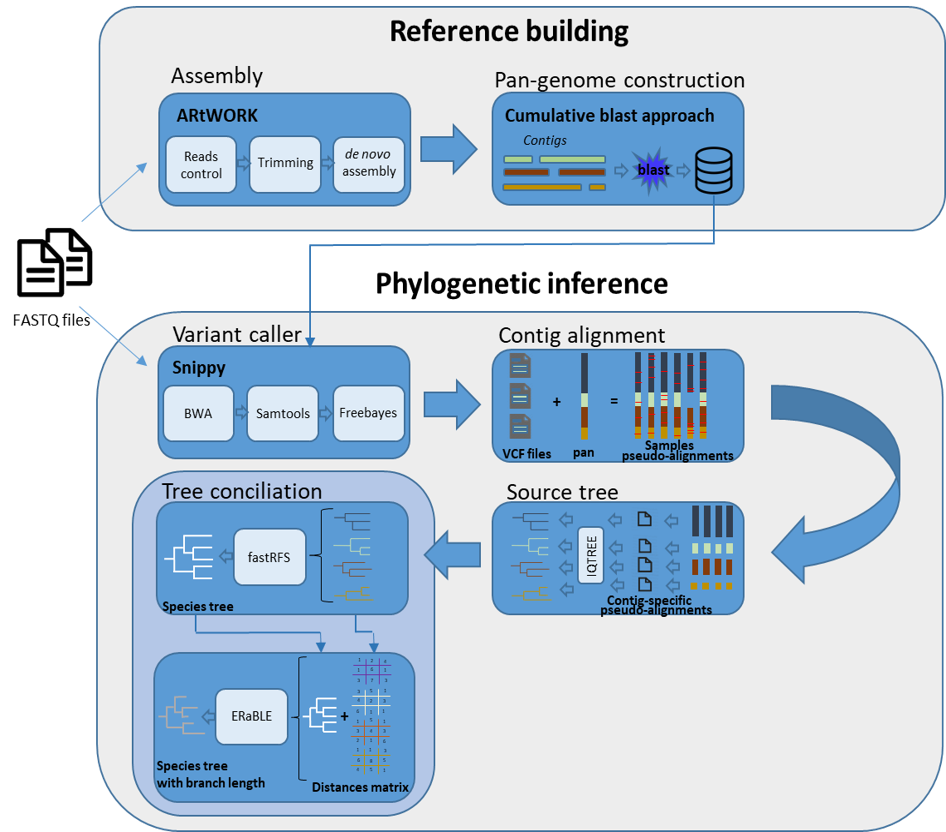

# pgSNP : Pangenome SNP pipeline

This pipeline was developped to infer a pangenomic SNP phylogenomic tree from paired-end reads and contigs.

## Description
The strategy of the pangenome analysis we designed can be summarized in two main steps: 1/ defining the reference pangenome on which we can compare all sequences present in at least four samples among all those of a set and 2/ characterizing sample using phylogenomic approaches under an evolutionary model.
In short, we summarize the genomic content present across all the samples into a reference pangenome : a repertoire of unique sequences, where redundant genomic elements are merged. This reference pangenome is then used together with variant calls for each sample to reconstruct a phylogenomic tree depicting the sample phylogeny.
To address the phylogenomic tree reconstruction of samples that do not share all of their sequences due to the inclusion of the accessory part, i.e. when a sample do not have an accessory segment, we resort to a two step approach:
First, we generate multiple trees, one for each segment of continuous homogeneous set of samples. Second, we reconcile the phylogenomic information from all the segment trees into a super tree.

## Installation

A netflow and maybe a conda version will be uploaded.
This pipeline require :
python3 with Biopython
Snippy (https://github.com/tseemann/snippy)
IQ-TREE (http://www.iqtree.org/)
R with phytools
BLASTN

Using a new conda, I was able to easily install the programs used by the pipeline with :
`conda install -c bioconda blast`

`conda install -c bioconda iqtree`

`conda install -c bioconda r-phytools`

`conda install -c conda-forge biopython`

`conda install -c bioconda snippy`

`conda update samtools`

The conda Snippy version is 3.1, while the last version on Github is 4.6. The 3.1 have some trouble at the alignment step, so I added a copy of the Snippy directory in the bin section.
## How to run

`python3 pgSNP.py -contig data/contigs/ -o results/ -reads data/reads/ -cpus 12`

This version is not completelly parallelized, only IQ-TREE and Snippy are able to fully use your CPUs. Please check the number of CPUs before running (or it can caused some crash with IQ-TREE).

## Options

Many options are available on this pipeline, described in the `python3 pgSNP.py -h`. Some of them are not really usefull (as the name of tempory files for examples).
The main options :

| Command | Description |
| ----------- | ----------- |
| -contig | Folder which contains your contigs or file which contains all path for contig location. Currently, the pipeline doesn't autommatically create contigs from raw reads, so you need to add yours (using SPAdes for example (https://github.com/ablab/spades)) |
| -reads | Folder which contains your reads. Yours reads must be paired-end, in fastq or fastq.gz format. Currently the reads format of the pipeline is **ID\_R1.fastq.gz ID\_R2.fastq.gz**. Examples can be seen in data/reads|
| -o | Output name of your output folder. Must be created. Please create an empty folder to put the results, currently the tempory files are not well mannaged, and deleted using rm command (will be fixed soon). |
| -cpus | Number of CPUs available on your computer (default 12)|   
| -identity | Blastn identity for the pangenome step (default 95)|   
| -hit-min | Minimum sequence length for a fragment to be added to the pangenome reference (default 500 bases)|   

## How to cite

This pipeline is not published yet. 
